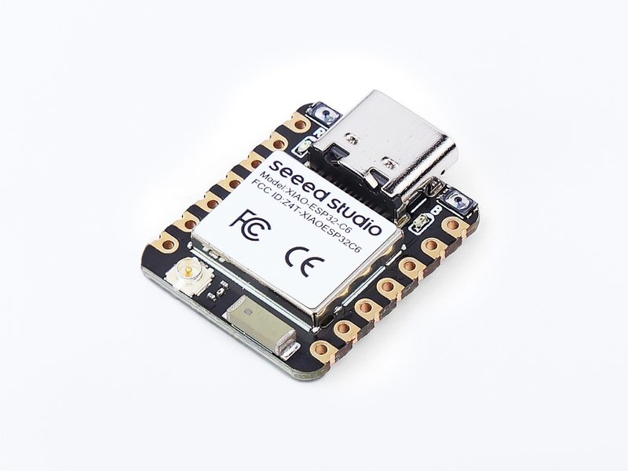

# Seeed XIAO ESP32C6 (Sense Node Mainboard)

[中文文档](README.zh.md) | [English](README.md)

[](https://github.com/Mi-Bee-Studio/seeed-xiao-esp32c6/actions/workflows/build.yml)



A board under the board-centric repo convention. **This repo is organized with the board as root:**

```
seeed-xiao-esp32c6/
├── README.md          # this file: all hardware info for this board
└── <project>/         # one directory per project built on this board (named by capability)
    ├── CMakeLists.txt / main/ / sdkconfig.defaults / main/idf_component.yml
    └── README.md      # project description + build/flash commands
```

Key points of the convention:

- **Board directory name** = board name (kebab-case); the root README covers hardware only, never project content;
- **Each project directory builds standalone**: it ships the full ESP-IDF project trio (top-level CMakeLists,
  `main/`, `sdkconfig.defaults`); `cd <project> && idf.py build` produces the firmware;
- Projects share no code; when commonality is needed, copy first, and consider extracting a shared component only once things stabilize.

### Firmware baseline norms (mandatory fleet-wide)

1. **Watchdog: mandatory.** Tasks subscribe to the ESP-IDF TWDT and feed it periodically;
2. **Web/API firmware upgrade (OTA): mandatory where the hardware allows.** This board has
   WiFi and 4 MB flash fits dual OTA slots, so every project ships a web upgrade path.

| Project | Watchdog | Web/API OTA |
|---------|----------|-------------|
| blink | ✅ per-task TWDT (5 s panic) | ✅ dual OTA slots + streaming `POST /ota` |

---

## Board Overview

| Item | Value |
|------|-------|
| Chip | **ESP32-C6FH4** — RISC-V single-core @ 160 MHz (schematic part number, not a module) |
| Flash | 4 MB (in-package) |
| PSRAM | None (512 KB SRAM) |
| Wireless | **WiFi 6** 2.4 GHz (802.11 b/g/n/ax) + Bluetooth 5 (LE), Zigbee/Thread (802.15.4) |
| USB | Native USB Type-C (**USB-Serial-JTAG**: console + flashing on one port, no bridge chip) |
| Onboard LED | **User LED = GPIO15** (single-color, orange per wiki) + red charge LED |
| Buttons | BOOT = **GPIO9** (hold at power-up for download mode), RESET |
| Antenna | Built-in ceramic antenna + **U.FL external connector**; RF switch GPIO14 (low = internal, default), GPIO3 pulled low enables the switch |
| Dimensions | 21 × 17.8 mm (standard XIAO form factor) |

## Pinout Diagram (USB-C pointing up, front/component-side view; D numbers = XIAO silkscreen)

```
                 ┌─ USB-C ─┐
       5V ◎┬───┘          ├───┬◎ D0 = GPIO0  (ADC, LP_GPIO0)
      GND ◎│              │   ◎ D1 = GPIO1  (ADC, LP_GPIO1)
      3V3 ◎│  [USER LED]  │   ◎ D2 = GPIO2  (ADC, LP_GPIO2)
     D8 ◎  │   = GPIO15   │   ◎ D3 = GPIO21 (SDIO_DATA1)
     D9 ◎  │              │   ◎ D4 = GPIO22 (I2C SDA)
    D10 ◎  │  ESP32-C6FH4 │   ◎ D5 = GPIO23 (I2C SCL)
           │              │   ◎ D6 = GPIO16 (UART TX)
           └──────────────┘   ◎ D7 = GPIO17 (UART RX)
            left row (front)  right row (front)

  Back JTAG pads: MTDO=GPIO7 · MTDI=GPIO5 · MTCK=GPIO6 · MTMS=GPIO4
  (MTDI/MTCK/MTMS double as ADC)
```

Key points (pin mapping per the [Seeed wiki Pin Map](https://wiki.seeedstudio.com/xiao_esp32c6_getting_started/)):

- **Left row** (downward from USB): `5V · GND · 3V3 · D8=GPIO19(SPI SCK) · D9=GPIO20(SPI MISO) · D10=GPIO18(SPI MOSI)`;
- **Right row** (downward from USB): `D0=GPIO0 · D1=GPIO1 · D2=GPIO2 · D3=GPIO21 · D4=GPIO22(SDA) · D5=GPIO23(SCL) · D6=GPIO16(TX) · D7=GPIO17(RX)`;
- **GPIO14/3 are the antenna-switch pins** — do not repurpose (GPIO14 low selects the internal antenna = default);
- Physical pad order follows the official Seeed pinout diagram; this figure uses the fleet-standard "USB-C up" view.

## Caveats

- **No USB-UART bridge**: the serial port is the C6's native USB-Serial-JTAG (console/flashing/JTAG on one port);
- BOOT = GPIO9 — hold while plugging USB / pressing RESET for download mode;
- The C6 also carries an **802.15.4 (Zigbee/Thread) radio** — the hardware basis for future Matter/Thread nodes;
- 512 KB SRAM, no PSRAM — plan large buffers carefully (same league as the ESP32-C3).

## Project Index

| Project | Description |
|---------|-------------|
| [blink](blink/README.md) | Baseline/test firmware: USER LED (GPIO15) heartbeat + BOOT interaction + web maintenance page (provisioning/OTA) + TWDT watchdog |
